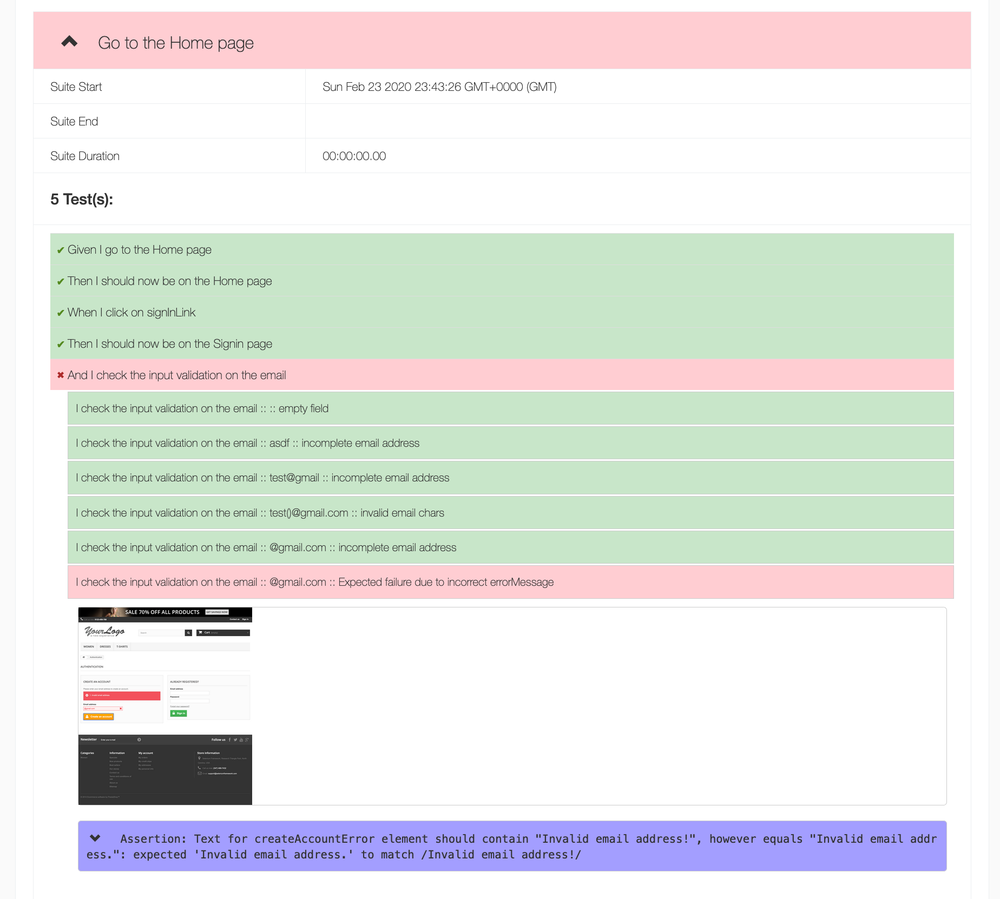
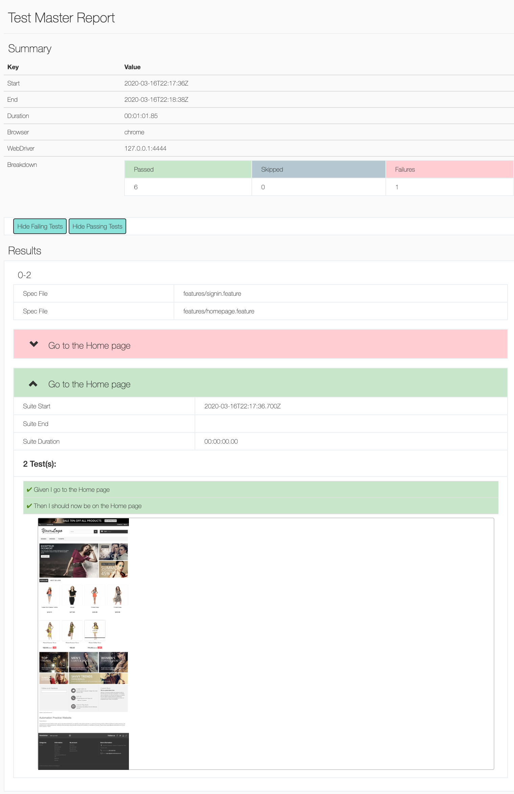

# wdio-fefanf-html-reporter
A reporter for webdriver.io which generates a HTML report.
This project is a fork of [@rpii/wdio-html-reporter](https://www.npmjs.com/package/@rpii/wdio-html-reporter), which was itself a fork of a reporter I had previously created [wdio-html-format-reporter](https://www.npmjs.com/package/wdio-html-format-reporter)


## Installation

The easiest way is to keep the `wdio-fefanf-html-reporter` as a devDependency in your package.json:

```javascript
{
  "devDependencies": {
    "wdio-fefanf-html-reporter": "~0.0.1"
  }
}
```

Or, you can simply do it with:

```
npm install wdio-fefanf-html-reporter --save-dev
```


## Configuration
The following code shows the default wdio test runner configuration. Just add an HtmlReporter object as another reporter to the reporters array.  Syntax shown requires babel:

```javascript
// wdio.conf.js
import { ReportAggregator, HtmlReporter} from 'wdio-fefanf-html-reporter' ;
module.exports = {

  
  reporters: ['spec',
        [HtmlReporter, {
            debug: true,
            outputDir: './reports/html-reports/',
            filename: 'report.html',
            reportTitle: 'Test Report Title',
            
            //to show the report in a browser when done
            showInBrowser: true,

            // to use the template override option, can point to your own file in the test project:
            // templateFilename: path.resolve(__dirname, '../src/wdio-fefanf-html-reporter-alt-template.hbs'),
            
            // to add custom template functions for your custom template:
            // templateFuncs: {
            //     addOne: (v) => {
            //         return v+1;
            //     },
            // },

            //to initialize the logger
            LOG: log4j.getLogger("default")
        }
        ]
    ]
    
 
};
```
## Configuration Options:
  
### To generate a master report for all suites

webdriver.io will call the reporter for each test suite.  It does not aggregate the reports.  To do this, add the following event handlers to your wdio.config.js

```javascript
    onPrepare: function (config, capabilities) {

        let reportAggregator = new ReportAggregator({
            outputDir: './reports/html-reports/',
            filename: 'master-report.html',
            reportTitle: 'Master Report',
            
            // to use the template override option, can point to your own file in the test project:
            // templateFilename: path.resolve(__dirname, '../src/wdio-fefanf-html-reporter-alt-template.hbs')
        });
        reportAggregator.clean() ;

        global.reportAggregator = reportAggregator;
    },
    
    onComplete: function(exitCode, config, capabilities, results) {
        (async () => {
            await global.reportAggregator.createReport( {
                config: config,
                capabilities: capabilities,
                results : results
            });
        })();
    },
    
``` 
### To use a logger for debugging

A new feature for developers is to add a log4js logger to see detailed debug output.  See the test/reporter.spec.js for configuration options
 
  
### To use a custom handlebars template for reports

Uncomment the templateFilename above, and in the ReportAggregator.  You must provide an absolute path to the file you can modify the alt-template above if you wish
The template must support all the constructs in the default template.  YOu may add more or just change the formatting and css.

## Add Message and Screenshots to the Html Report:

## To show messages in the html report

Add the function below to your test code and call it when you want to output a message

```javascript
    logMessage(message) {
        process.emit('test:log', message);
    }
```

## To take Screenshots:

Add a function that you can call from anywhere in your test:

```javascript
    takeScreenshot(message) {
        const timestamp = moment().format('YYYYMMDD-HHmmss.SSS');
        fs.ensureDirSync('reports/html-reports/screenshots/');
        const filepath = path.join('reports/html-reports/screenshots/', timestamp + '.png');
        this.browser.saveScreenshot(filepath);
        this.logMessage(message) ;
        process.emit('test:screenshot', filepath);
        return this;
    }
``` 
## To take a screenshot after any test fails:
```javascript
wdio.conf.js

    afterTest: function (test) {
        const path = require('path');
        const moment = require('moment');

        // if test passed, ignore, else take and save screenshot.
        if (test.passed) {
            return;
        }
        const timestamp = moment().format('YYYYMMDD-HHmmss.SSS');
        const filepath = path.join('reports/html-reports/screenshots/', timestamp + '.png');
        browser.saveScreenshot(filepath);
        process.emit('test:screenshot', filepath);
    },
```

## InnerStep results
This is a feature tied in the the [wdio-fefanf-boilerplate](https://github.com/aruiz-caritsqa/wdio-fefanf-boilerplate) project.
One thing that I missed about Jest was the [jest-each](https://jestjs.io/docs/en/api#2--describeeachtablename-fn-timeout-) capability. That can now be achieved with `mdTableToJson`. The results from those tests can be displayed using this reporter doing the following:

```javascript
Then(/^I check the input validation on the email$/, async () => {
  const scenarios = mdTableToJson(`
  | email            | errorMessage           | desc                                           |
  | ---------------- | ---------------------- | ---------------------------------------------- |
  |                  | Invalid email address. | empty field                                    |
  | asdf             | Invalid email address. | incomplete email address                       |
  | test@gmail       | Invalid email address. | incomplete email address                       |
  | test()@gmail.com | Invalid email address. | invalid email chars                            |
  | @gmail.com       | Invalid email address. | incomplete email address                       |
  | @gmail.com       | Invalid email address! | Expected failure due to incorrect errorMessage |
  `);

  for (let i = 0; i < scenarios.length; i += 1) {
    const { email, errorMessage, desc } = scenarios[i];
    await Steps.iTypeInto('emailCreateField', email);
    await Steps.iClickOn('createAccountButton');

    await Steps.iShouldSee('createAccountError');
    try {
      await Steps.textShouldContain('createAccountError', errorMessage);
    } catch (e) {
      process.emit('test:innerStepFail', `I check the input validation on the email :: ${email} :: ${desc}`);
      throw e;
    }
    process.emit('test:innerStepPass', `I check the input validation on the email :: ${email} :: ${desc}`);
  }
});
```


## Sample Output:


